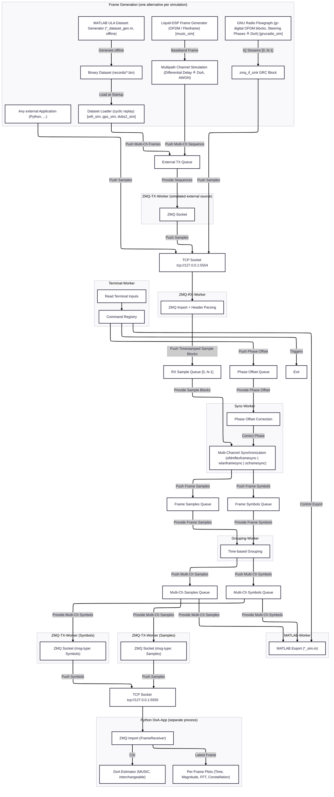
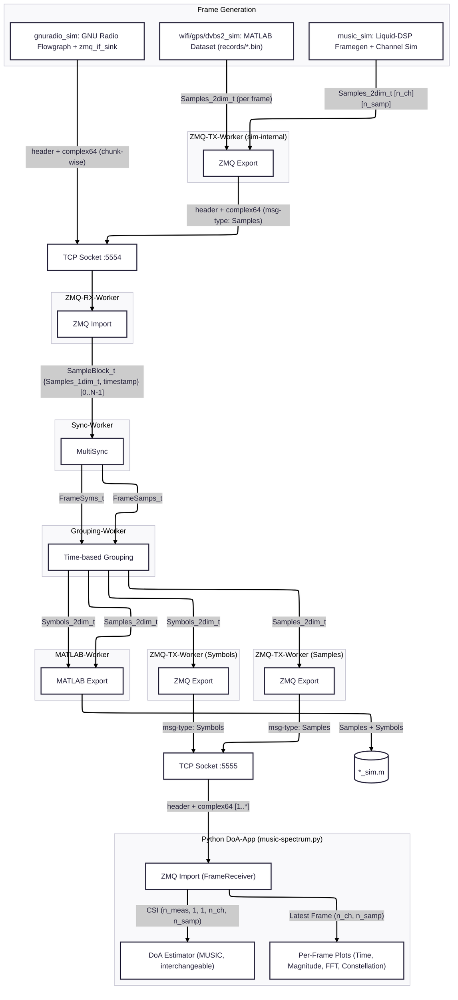
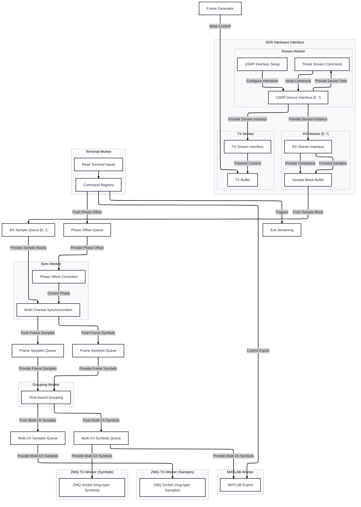
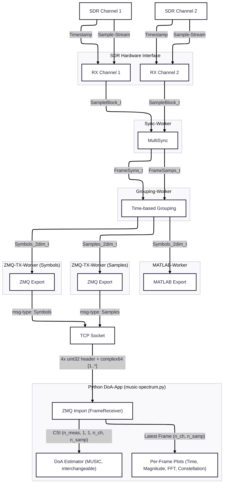

# doa4rfc
#### Realtime Direction-of-Arrival Estimation for RF Communication Protocols

## Objective  
This project aims to provide a flexible software architecture to implement and test DoA methods for various RF communication protocols.

## Main Features
- [Main Application](src/main.cc): Estimation of the DoA of a transmitted OFDM / singlecarrier signal

### Multichannel Frame Synchronization 
-  [MultiSync](include/multisync/README.md) for simultaneous processing and phase offset correction with multiple generic frame synchronizers based on [Liquid-DSP](https://liquidsdr.org)

### Multithread Architecture 
- [Sync-Worker](include/sync_worker/include/sync_worker.h): Multichannel frame detection and synchronization
- [Grouping-Worker](include/grouping_worker/include/grouping_worker.h): Identification of frames related across channels
- [UI-Worker](include/ui_worker/include/ui_worker.h): Provision of terminal interface 

### DoA Estimation Algorithms
- [MUSIC Algorithm](music/music-spectrum.py) (multiple signal classification) python app based on [pyespargos](https://github.com/ESPARGOS/pyespargos) 

### Interfaces 
- [ZMQ TCP interface](include/interfaces/zmq/README.md): Standardized TCP transmission of multidimensional sample-vectors
- [MATLAB interface](include/interfaces/matlab/include/matlab_if.h): Generation of .m files for plotting signals and constellation diagrams in MATLAB (check [matlabXport](https://github.com/F-L-X-S/matlabXport))
- [UHD interface](include/interfaces/uhd/include/uhd_if.h): Hardware interface for USRP SDRs (especially N210)

## Simulations
 [Simulations](simulations/) provided in ./simulations demonstrate the usage of the provided modules, illustrate the underlying mathematical concepts and show the simulation results:
- [DoA-Estimation with MUSIC for Single- and Multicarrier Signals](simulations/music/README.md) 
- [Single-Channel CFR-Estimation](simulations/sim_singlechannel/README.md) 
- [Multi-Channel CFR-Estimation](simulations/sim_multichannel/README.md)

### Simulation Process Flow
All protocol simulations share the processing pipeline of the main application, but replace the SDR hardware interface by the ZMQ import socket (`tcp://127.0.0.1:5554`). The multi-channel baseband frames are generated per simulation either internally with Liquid-DSP (`music_sim`), loaded from a MATLAB-generated ULA dataset file (`wifi_sim`, `gps_sim`, `dvbs2_sim`), or streamed live by an external application — a GNU Radio flowgraph using the [zmq_if_sink block](gnuradio/README.md) (`gnuradio_sim`) or any process pushing the [ZMQ wire format](include/interfaces/zmq/README.md). Each worker runs in a separate thread and is decoupled by thread-safe queues; the DoA application runs as a separate Python process.


### Simulation Data-flow
The diagram below shows the data formats along the pipeline: all ZMQ messages carry the wire format `4 x uint32 header [msg_type, n_measurements, n_channels, n_samples]` followed by the `complex64` payload (row-major `[measurement][channel][sample]`). The ZMQ-RX-Worker decomposes each message into per-channel `SampleBlock_t` items with a shared receive-timestamp used by the Grouping-Worker to relate frames across channels. The synchronizer type is selected per simulation via `SyncTraits` (`ofdmflexframesync` — music, `wlanframesync` — wifi/gnuradio, `scframesync` — gps/dvbs2).


## Measurements
[Measurements](measurements/) show the real-world DoA results of the [Application](src/main.cc) using two USRP N210 with WBX daughterboard and provide the corresponding datasets.

## DoA estimation with USRP N210
 The [Main Application](src/main.cc) gives you a functioning example on how to employ the provided modules for DoA estimation with USRP N210. 


### Main App Process Flow

### Main App Data-flow
The following diagram illustrates, how samples are streamed from the two SDR-instances, synchronized as sample-blocks with a unique timestamp based on the SDRs device-time and how the frame samples and demodulated symbols from detected frames are grouped across channels and forwarded to the Python DoA-application (both message types share one ZMQ socket, distinguished by the msg-type header field).


### Hardware Setup 
The software is tested using two USRP N210 with the WBXv3 daughterboard. Phase synchronization is achieved with the MIMO-cable. The USRPs are connected to the host by separate ethernet interfaces. For utilizing a different type of SDRs, the interfaces can be implemented in separated threads similar to [uhd_if.h](include/interfaces/uhd/include/uhd_if.h).  <br>
One USRP is used for transmitting and receiving the OFDM packages while the other USRP is used in RX-mode only. The MUSIC-spectrum visualizes the position of the TX-antenna. 
 <br>
Make sure, the receiving antennas are spaced by the half wavelength of the carrier frequency (e.g. 12cm for a carrier of 1.25GHz).

### Terminal Interface
The application provides an interactive terminal interface ([TerminalWorker](include/ui_worker/include/ui_worker.h)) with the following built-in commands:

| Command | Usage | Description |
|---------|-------|-------------|
| `help` | `help` | List all available commands |
| `matlab` | `matlab <on\|off\|single>` | Control MATLAB export: `on` enables continuous export, `off` disables export (prevents large .m files), `single` exports only the next received frame |
| `adjust_phase` | `adjust_phase <channel> <phase_rad>` | Increment the NCO phase of a specific channel by the given value [rad] |
| `set_phase` | `set_phase <channel> <phase_rad>` | Set the NCO phase of a specific channel to an absolute value [rad] |
| `exit` | `exit` / `quit` / `q` | Terminate the program |

Custom commands can be registered at runtime via `TerminalWorker::RegisterCommand()`.

### Installation 
1. Clone the Repo to your local machine
2. Setup a virtual environment within the `./music/`directory <br>
   ```
   cd ./music
   python -m venv env
   ```
3. Install all python dependencies specified in `requirements.txt` <br>
   ```
    source env/bin/activate
    pip install -e . 
   ``` 
4. Use the CMake extension to configure the project 
5. Set `doa4rfc` as target for build and execution (or any sim-file)
6. Go to the vscode "run and debug" menu and start the `Debug (Clang CMake Preset)` task to build and run the specified target 
<br><br>

Make sure, that all USRPs are connected via separate Ethernet interfaces, since the datarate can possibly cause overflows in the shared-Etehrnet mode. Check the USRP connection by running `uhd_find_devices`. 

#### How to add the doa4rfc GNU Radio block
The GRC block `zmq_if_sink` (streams IQ samples from a GNU Radio flowgraph to doa4rfc via ZMQ) is a lightweight pure-Python block in [gnuradio/](gnuradio/) — see [gnuradio/README.md](gnuradio/README.md) for the installation steps (block path registration and Python import setup).

### Main Dependencies
- [ZMQ](https://zeromq.org/languages/cplusplus/) for socket communication with the Python-implemented DoA Algorithm 
- [Liquid-DSP](https://liquidsdr.org) for frame-detection, generation and synchronization
- [UHD](https://files.ettus.com/manual/index.html) for USRP communication
