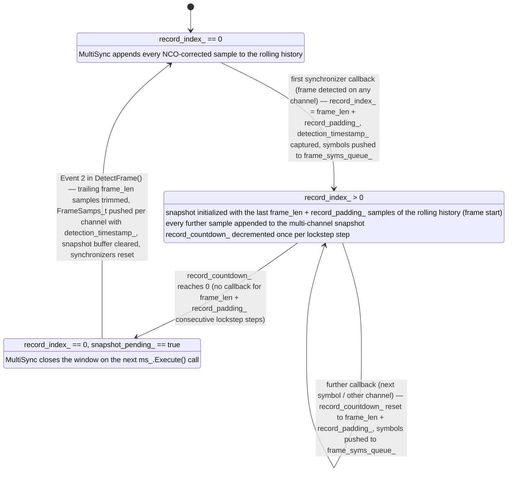

# Sync-Worker
### Multichannel Frame Detection and Sample Recording
The `SyncWorker` class-template (defined in [sync_worker.h](include/sync_worker.h)) runs the multi-channel synchronization as a dedicated thread ([MultithreadWorker](../multithread_worker/include/multithread_worker.h)). It consumes timestamped sample-blocks from the per-channel RX queues, feeds them sample-by-sample through its internal [MultiSync](../multisync/README.md) instance and — once a frame is detected — records a **time-aligned multi-channel snapshot** of the frame samples. The synchronizer type is selected via the `synchronizer_iface` template parameter (a `SyncTraits` specialization, see [synctraits.h](../multisync/include/synctraits.h)).

| Queue | Direction | Item type | Purpose |
|---|---|---|---|
| `rx_queues_[0..N-1]` | in | `SampleBlock_t` | Timestamped sample-blocks per channel (from `ZmqRxWorker` / UHD RX-workers) |
| `phi_corr_queue_` | in | `Phase_t` | NCO phase corrections (from Terminal-Worker) |
| `frame_samps_queue_` | out | `FrameSamps_t` | Recorded frame samples, one item per channel per detected frame |
| `frame_syms_queue_` | out | `FrameSyms_t` | Demodulated data symbols, pushed immediately per callback |

## Execute() — the worker loop
`Execute()` runs until the stop-signal is raised and performs the following steps per iteration:

1. **Apply phase corrections**: pop pending `Phase_t` items from `phi_corr_queue_` and set/adjust the NCO phase of the addressed channel in MultiSync.
2. **Collect input**: drain all newly arrived `SampleBlock_t` items from every channel's RX queue into per-channel FIFO buffers.
3. **Lockstep processing**: only proceed while *every* channel has at least one buffered block. Determine the smallest front-block size and process that many samples; for each sample index, assemble one sample per channel (`channel_samples`) plus the block timestamp and call `DetectFrame(channel_samples, timestamp)`. Processing in lockstep (ch&nbsp;0…ch&nbsp;N-1 on the same sample index before advancing) keeps the channels time-aligned and lets each channel's callback fire on the same step.
4. **Advance the recording countdown**: after every complete lockstep step, decrement `record_countdown_` (if a recording is active). When it reaches **0**, set `record_index_ = 0` and raise `snapshot_pending_` — this schedules the recording window to close on the very next `DetectFrame()` call.
5. **Consume**: erase the processed samples from the front blocks and sleep briefly only when no data is buffered or pending.

## DetectFrame() — one lockstep step
`DetectFrame()` processes one sample per channel and reacts to two possible events:

1. **Run the synchronizers**: `ms_.Execute(channel_samples, record_index_)` mixes each sample with the channel NCO and pushes it into the channel's synchronizer. Inside MultiSync the sample is also appended to a buffer: to the *rolling history* while searching, or to the *snapshot buffer* while recording. A `record_index_` transition `0 → N` opens the recording window (the rolling history is trimmed to its last `N` samples and becomes the start of the snapshot); a transition `N → 0` closes it. If a synchronizer detects a frame, its callback stores `frame_len` and the demodulated symbols in the channel's `CallbackData_t` and returns `1`, so the synchronizer is reset after every callback and subsequent symbols/frames re-trigger detection.
2. **Event 1 — callback fired on any channel** (opens or extends the recording):
   - `record_countdown_` is (re-)set to `frame_len + record_padding_` — every further callback keeps the window open for another full frame-length of steps.
   - `snapshot_trim_len_` is set to `frame_len` (the number of trailing samples to discard when the window closes).
   - **Only if not already recording** (first callback of a frame): `record_index_` is set to `frame_len + record_padding_`, which opens the window on the *next* `ms_.Execute()` call — initialized with the last `frame_len + record_padding_` samples of the rolling history, i.e. **the recording reaches back to the start of the detected frame**. The block timestamp is captured as `detection_timestamp_`.
   - The demodulated symbols are pushed to `frame_syms_queue_` immediately (tagged with channel and timestamp), for every callback on every channel.
3. **Event 2 — recording window just closed** (`snapshot_pending_` raised by `Execute()` and MultiSync no longer recording): the complete multi-channel snapshot is read via `GetMultiChannelFrameSamps()`, the trailing `snapshot_trim_len_` samples are trimmed from each channel (pure noise accumulated after the last callback) and one `FrameSamps_t` per channel — tagged with `detection_timestamp_` — is pushed to `frame_samps_queue_`. The snapshot buffer is cleared and all synchronizers are reset for the next frame.

## Recording lifecycle
Recording therefore **starts retroactively** with the first synchronizer callback (the snapshot begins `frame_len + record_padding_` samples *before* the triggering step) and **stops automatically** once no callback has fired for `frame_len + record_padding_` consecutive lockstep steps. Since the trailing `frame_len` samples are trimmed, the pushed snapshot ends `record_padding_` samples after the last detected symbol:

```
samples:  ──────────────|■■■■■■■■■■■■■■■■■■■■■■■■■■■■■■■■■■■|─────────────────
                        ^ snapshot start:                   ^ snapshot end:
                        frame_len + record_padding_         record_padding_ samples
                        samples before the                  after the last callback
                        first callback                      (trailing frame_len
                        (≙ frame start)                     noise samples trimmed)
```


