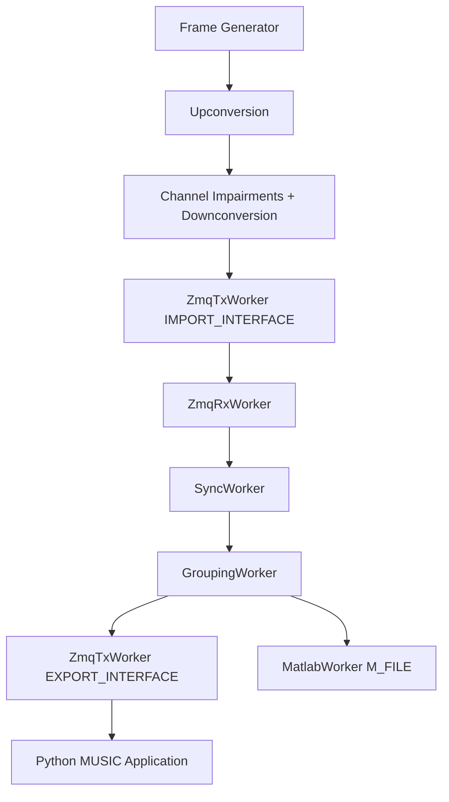

# Simulation doa4rfc with MUSIC 

This simulation demonstrates Direction-of-Arrival (DoA) estimation using the MUSIC algorithm within the `doa4rfc` worker-based framework. It generates a multipath transmission of a baseband signal (multicarrier OFDM or single-carrier) with configurable channel impairments (noise, time-delay, frequency and phase offset) and streams the isolated baseband samples of the detected frame to a Python MUSIC application via ZMQ sockets.
The additional ZMQ socket (`IMPORT_INTERFACE`) is not strictly required for the simulation itself, but demonstrates how baseband samples could be imported from an external application (e.g. GNU Radio).


### Differential Time-Delay in Correspondence to DoA
| Symbol    | Description                                                            |
| --------- | ---------------------------------------------------------------------- |
| $f_S$    | Sampling frequency `SAMPLE_RATE`            |
| $f_c$    | Carrier frequency `CARRIER_FREQUENCY`       |
| $\theta$ | Direction of Arrival                                      |
| $\lambda$ | Wavelength corresponding to $f_c$                                      |
| $\tau$    | Differential Time-delay between multipath-channels in seconds          |
| $\Tau$    | Differential Time-delay between multipath-channels in Samples `DDELAY` |

Time-delay $\Tau$ between neighboring antennas in ULA with $\frac{\lambda}{2}$ spacing:
```math
\tau=\frac{sin(\theta)}{2*f_c}
```
```math
\Tau= \tau* f_S = 0.5*sin(\theta)*\frac{f_S}{f_c}
```

e.g. $\theta=60°$,  $f_c = 6.0e5\ Hz$, $f_S = 3.84e6\ Hz$
```math
\Tau = sin(60°)/(2*6.0e5\ Hz) * 3.84e6\ Hz  = 2.7713\ samples
```
e.g. $\theta=45°$,  $f_c = 6.0e5\ Hz$, $f_S = 3.84e6\ Hz$
```math
\Tau = sin(45°)/(2*6.0e5\ Hz) * 3.84e6\ Hz = 2.2627\ samples
```
e.g. $\theta=30°$,  $f_c = 6.0e5\ Hz$, $f_S = 3.84e6\ Hz$
```math
\Tau = sin(30°)/(2*6.0e5\ Hz) * 3.84e6\ Hz  = 1.6\ samples
```

Note, that an increased basis-delay of approximately DELAY = 10 samples ensures a better performance of the fractional delay filter.


### Up-/Downconversion
| Symbol   | Description                                 |
| -------- | ------------------------------------------- |
| $\phi_c$ | Carrier Phase Offset `CARRIER_PHASE_OFFSET` |

Modulation of each $n$-th sample $x[n]$ with NCO (Numerically Controlled Oscillator):
Analog Carrier Signal: 
```math
exp(j2\pi f_c t + \phi_c)
```
Time of the n-th sample (a baseband sample corresponds to a period of $\frac{1}{f_S}$ seconds):
```math
\qquad t=\frac{n}{f_S}
```
Upconversion to `tx[n]`:
```math
x[n] = x[n]*exp(j2\pi f_c*\frac{n}{f_S}) 
```
Downconversion to `rx[n]`: 
```math
x[n] = x[n]*exp(-j(2\pi f_c*\frac{n}{f_S}+\phi_c))
```

### Signal power
| Symbol              | Description                    |
| ------------------- | ------------------------------ |
| $\sigma^2$          | Noise Floor `NOISE_FLOOR`      |
| $SNR_{dB}$          | Signal-to-Noise Ratio `SNR_DB` |
| $\lvert X \rvert^2$ | Signal Power                   |
Signal Power $\lvert X \rvert^2$:

```math
\lvert X \rvert^2 = SNR_{dB}-\sigma^2
```

## Configuration

All parameters are configured via preprocessor defines in `music_sim.cc`:

### Transmission Settings

| Define              | Default | Description                                       |
| ------------------- | ------- | ------------------------------------------------- |
| `FRAME_PADDING`     | 30      | Noisy samples around the frame (before and after) |
| `NUM_CHANNELS`      | 4       | Number of simulated multipath channels            |
| `SAMPLE_RATE`       | 3.84e6  | Sample rate [Hz]                                  |
| `CARRIER_FREQUENCY` | 6.0e5   | Carrier frequency [Hz]                            |

### Channel Impairments

| Define                 | Default  | Description                                   |
| ---------------------- | -------- | --------------------------------------------- |
| `NOISE_FLOOR`          | -90.0 dB | Noise floor                                   |
| `SNR_DB`               | 40.0 dB  | Signal-to-noise ratio                         |
| `CARRIER_FREQ_OFFSET`  | 0.0      | Carrier frequency offset [rad/sample]         |
| `CARRIER_PHASE_OFFSET` | 0.0      | Phase offset [rad]                            |
| `DELAY`                | 1.0      | Base time-delay [samples]                     |
| `DDELAY`               | 1.6      | Differential delay between channels [samples] |

### Frame Generator

| Define        | Default             | Description            |
| ------------- | ------------------- | ---------------------- |
| `PAYLOAD_LEN` | 4                   | Payload length [bytes] |
| `MOD_SCHEME`  | `LIQUID_MODEM_QPSK` | Modulation scheme      |
| `CHECK`       | `LIQUID_CRC_16`     | Data validity check    |
| `FEC0`        | `LIQUID_FEC_NONE`   | Inner FEC              |
| `FEC1`        | `LIQUID_FEC_NONE`   | Outer FEC              |

### Modulation Type Selection

Select the baseband signal by defining one of:
- `OFDMFRAME` — multicarrier OFDM signal (default)
- `FLEXFRAME` — single-carrier signal

### Interfaces

| Define             | Default                                       | Description                                                            |
| ------------------ | --------------------------------------------- | ---------------------------------------------------------------------- |
| `IMPORT_INTERFACE` | `tcp://127.0.0.1:5554`                        | ZMQ socket for sample import from external application (e.g. Gnuradio) |
| `EXPORT_INTERFACE` | `tcp://127.0.0.1:5555`                        | ZMQ socket for export to MUSIC Python app                              |
| `PYTHONPATH`       | `./music/env/bin/python`                      | Python interpreter path                                                |
| `MUSIC_PYFILE`     | `./music/music-spectrum.py`                   | MUSIC algorithm Python script                                          |
| `M_FILE`           | `simulations/music_gnuradio/music_gnuradio.m` | MATLAB output file                                                     |

## Build and Run

### Prerequisites

1. Build the project:
   ```bash
   cmake --preset ClangDebug
   cmake --build build/ClangDebug --target music_sim
   ```

2. Set up the Python environment for the MUSIC algorithm:
   ```bash
   cd music && python -m venv env && source env/bin/activate && pip install -e .
   ```

### Run

```bash
./build/ClangDebug/music_sim
```

The simulation will:
1. Launch the Python MUSIC DoA estimation process
2. Start the worker threads (SyncWorker, GroupingWorker, ZMQ workers, MatlabWorker)
3. Generate a baseband frame, apply upconversion, channel impairments, and downconversion for each channel
4. Transmit the multichannel samples via ZMQ to the doa4rfc framework for synchronization and grouping
5. Export synchronized CFR data to the MUSIC Python application via ZMQ for DoA spectrum estimation
6. Store detected symbols and CFR data in a MATLAB `.m` file

The simulation runs for approximately 6 seconds and stops all workers automatically. Press `Ctrl+C` for early termination.

## Data Flow

